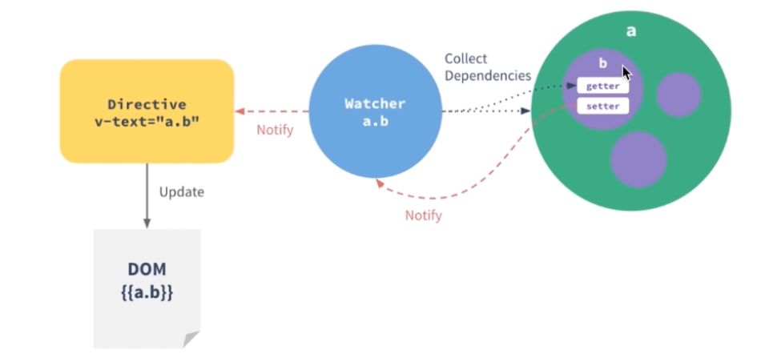

# Rebuild Chinese Uber-eats

## Small tools - Webpack & eslint

`webpack`: convert your code into directly executable code by browser

> webpack.base.conf.js to configure rules.


`eslint`: es6 code style examiner which can desperately uniform the code style of the group by a configure file.  

> in the `.eslintrc.js` file to configure the rules!


## Introduction to `MVVM`

[Nice article introducing MVVM and MVC](https://hackernoon.com/mvc-vs-mvvm-how-a-website-communicates-with-its-data-models-18553877bf7d)




## What is scaffolder? 

Scaffolder provides developer some primitive codes or fold structures, so that developers don't have to write some trivial code from scratch. `<template-name>` in `vue-cli` indicates what kinds of structures you want to have.


> You can mock data by `webpack`. Find the entry js file and then change the node file. 


## CSS Sticky footers

The purpose of a sticky footer is that it "sticks" to the bottom of the browser window. But not always, if there is enough content on the page to push the footer lower, it still does that. But if the content on the page is short, a sticky footer will still hang to the bottom of the browser window.

[Sticky Footer, Five Ways from css-tricks.com](https://css-tricks.com/couple-takes-sticky-footer/)


## Mechanism of Vue - getter and setter

[Explanations of getter and setter](https://developer.mozilla.org/zh-CN/docs/Web/JavaScript/Guide/Working_with_Objects#%E5%AE%9A%E4%B9%89_getters_%E4%B8%8E_setters)


## Calculate the height of dom

To achieve this, using api `clientHeight`


This is the formula to calculate.

You need to call `nextTick()` api, whenever you need to manipulate the vanilla DOM. 


## vue.set()

When you need to add new property to an object mounted on vue instance, you need this api to set `setter` and `getter`

## Tips Repository

### Conventions When Writing CSS

- Structure and position attributes first; then style attributes

### `line-height` vs `height`

If the content overflows one line in a `div`, the line-height will display two lines whose height is the value of `line-height`. While `height` only sets the `div` to single line, displaying the box-height as the value of `height` 

### display: block

use this on styling `<a>`, which will make the whole outside container tag clickable


###  repaint vs reflow

[What are repaint and reflow?](http://www.cnblogs.com/cencenyue/p/7646718.html)


### @media & media queries

[MDN: what is media query and why we need it? How do we use it?](https://developer.mozilla.org/en-US/docs/Web/CSS/Media_Queries/Using_media_queries)

You need media query to identify the `dpr` of the device, which will determine which icon file will be applied.

```stylus
bg-image($url)
	background-image: url($url + "@2x.png")
	@media (-webkit-min-device-pixel-ratio: 3), (min-device-pixel-ratio: 3)
    background-image: url($url + "@3x.png")
```

> To display a image, you don't have to use `` but `<span>` then set `inline-block` and background.

### `vertical-align`

This is a self-explanatory property in CSS. If you notice that some sibling tags are not aligned well, you can use this property.  Especially it will be set in `inline-block`.

`vertical-align: top` (align by wrapper)


### Hide the content overflow one line

We sometimes wanna hide the content overflowing the line and display "..." to prompt that there is hidden content. To achieve this:

```css
white-space: nowrap
overflow: hidden
text-overflow: ellipsis
```

> Sequences of whitespace will collapse into a single whitespace. Text will never wrap to the next line.


### position fixed vs absolute

`fixed` is really fixed, while the content will change according to the movement of scrollbar in `absolute` mode. 

 

### Why we need `font-size: 0` in `inline-block`?

[Chinese Explanation with pics](https://segmentfault.com/q/1010000008628181)


### Best case for table layout

When you need some grids to display the content with several lines and text should be placed in the center, you should consider `display: table-cell`


### Differentiate the `click` event from PC or Mobile

Check the exist of `event._constructed` property


### transition

Only `v-if`, `v-for`, `v-show` can trigger the transition in vue.

### Tricky Padding

Adding paddings to a button can increase clicking area. 


### dom.getBoundingClientRect()

Use this method you can get the relative top and left of an element relative to the browser.


### event bubbling and event capturing

Event bubbling and capturing are two ways of event propagation in the HTML DOM API, when an event occurs in an element inside another element, and both elements have registered a handle for that event. The event propagation mode determines in [which order the elements receive the event](http://www.quirksmode.org/js/events_order.html).

With bubbling, the event is first captured and handled by the innermost element and then propagated to outer elements.

With capturing, the event is first captured by the outermost element and propagated to the inner elements.

Capturing is also called "trickling", which helps remember the propagation order:

> trickle down, bubble up

Here is a great example using bubbling to make codes more concise: (click the `<li>` and display the corresponding color)

```html
<ul id="color-list">
    <li>red</li>
    <li>yellow</li>
    <li>blue</li>
    <li>green</li>
    <li>black</li>
    <li>white</li>
</ul>
```

If you don't use bubbling:

```js
(function(){
    var color_list = document.getElementById('color-list');
    var colors = color_list.getElementsByTagName('li');
    for(var i=0;i<colors.length;i++){                          
        colors[i].addEventListener('click',showColor,false);
    };
    function showColor(e){
        var x = e.target;
        console.log("The color is " + x.innerHTML);
    };
})();
```

If use bubbling:

```javascript
(function(){
    var color_list = document.getElementById('color-list');
    color_list.addEventListener('click',showColor,false);
    function showColor(e){
        var x = e.target;
        if(x.nodeName.toLowerCase() === 'li'){
            console.log('The color is ' + x.innerHTML);
        }
    }
})();
```


