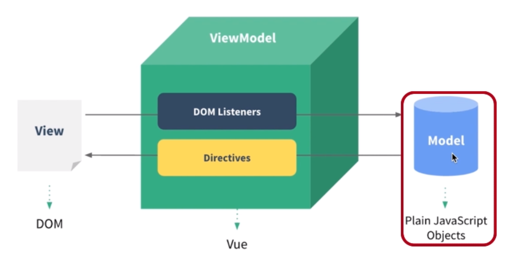
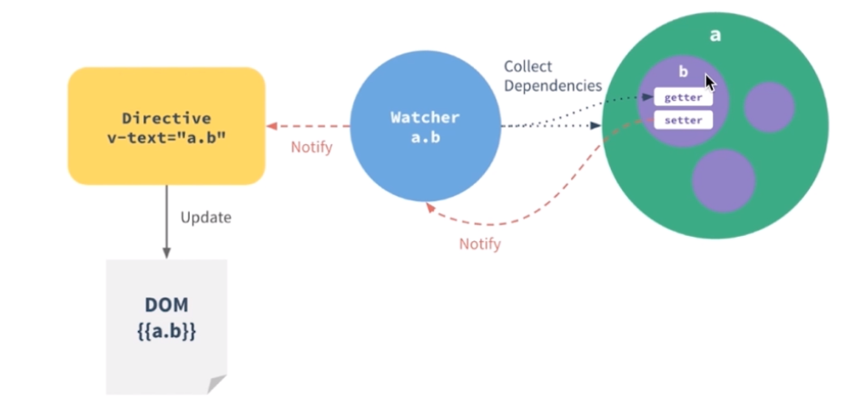

# Rebuild Chinese Uber-eats

## Small tools - Webpack & eslint

`webpack`: convert your code into directly executable code by browser

> webpack.base.conf.js to configure rules.

`eslint`: es6 code style examiner which can desperately uniform the code style of the group by a configure file.  

> in the `.eslintrc.js` file to configure the rules!

## Introduction to `MVVM`

[Nice article introducing MVVM and MVC](https://hackernoon.com/mvc-vs-mvvm-how-a-website-communicates-with-its-data-models-18553877bf7d)

## What is scaffolder? 

Scaffolder provides developer some primitive codes or fold structures, so that developers don't have to write some trivial code from scratch. `<template-name>` in `vue-cli` indicates what kinds of structures you want to have.

> You can mock data by `webpack`. Find the entry js file and then change the node file. 

## Tips Repository

### `line-height` vs `height`

If the content overflows one line in a `div`, the line-height will display two lines whose height is the value of `line-height`. While `height` only sets the `div` to single line, displaying the box-height as the value of `height` 

### display: block

use this on styling `<a>`, which will make the whole outside container tag clickable

###  repaint vs reflow

[What are repaint and reflow?](http://www.cnblogs.com/cencenyue/p/7646718.html)

## @media & media queries

[MDN: what is media query and why we need it? How do we use it?](https://developer.mozilla.org/en-US/docs/Web/CSS/Media_Queries/Using_media_queries)