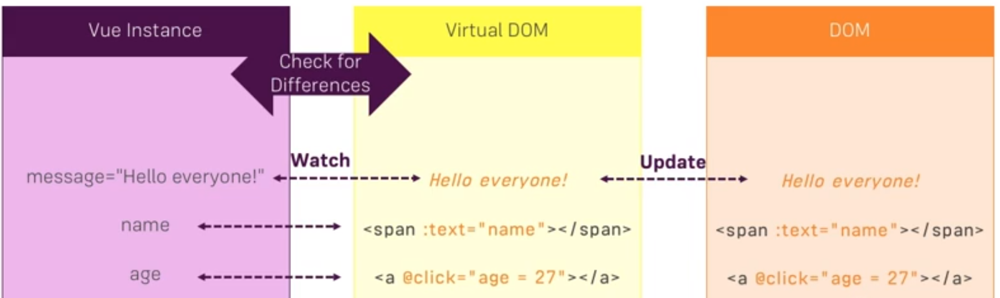
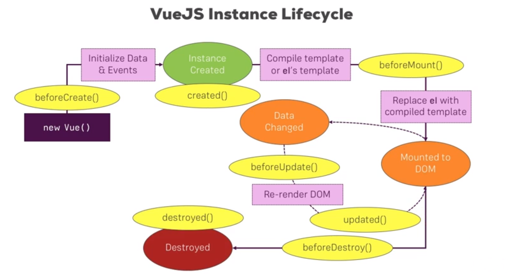
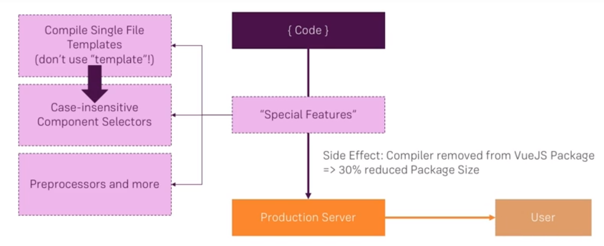
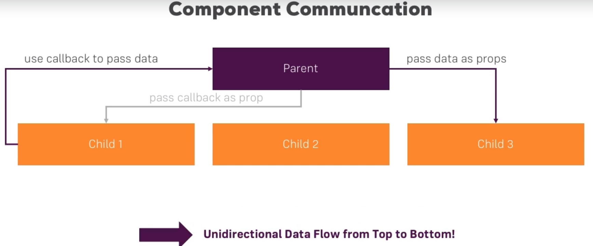
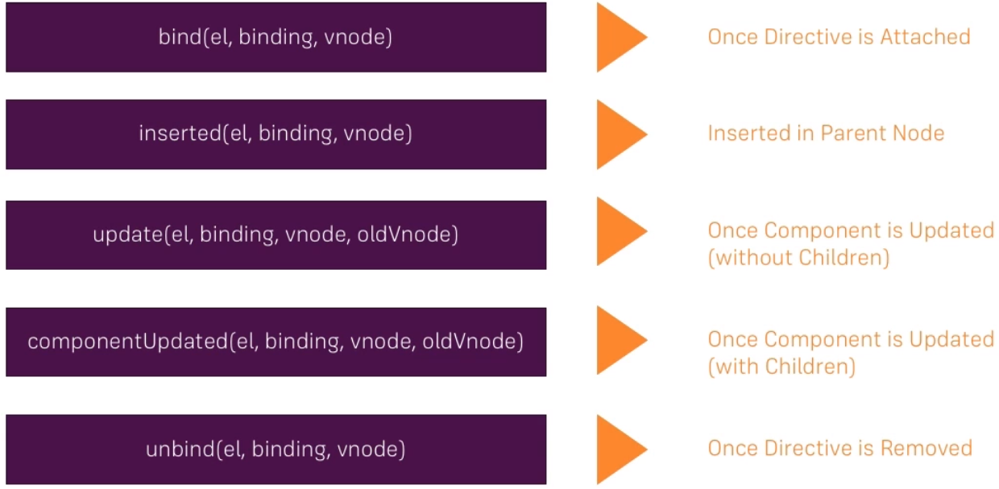
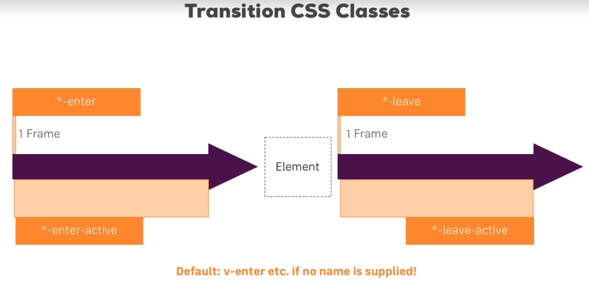
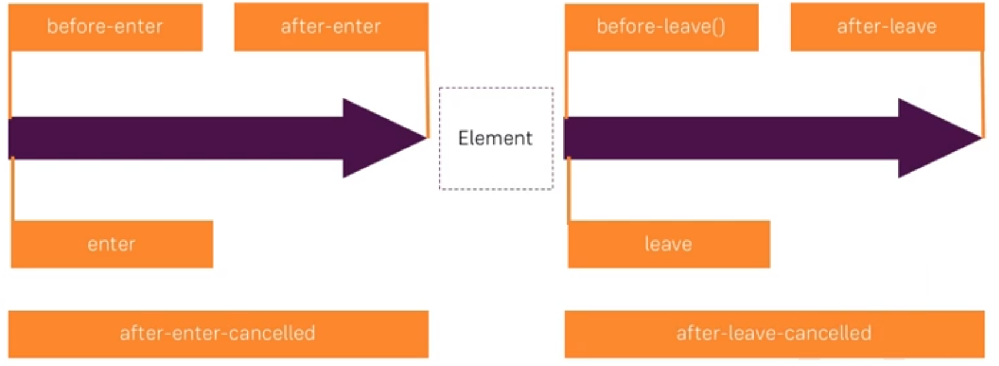

## `v-show`  vs `v-if`

`v-if` is “real” conditional rendering because it ensures that event listeners and child components inside the conditional block are properly destroyed and re-created during toggles.

`v-if` is also **lazy**: if the condition is false on initial render, it will not do anything - the conditional block won’t be rendered until the condition becomes true for the first time.

In comparison, `v-show` is much simpler - the element is always rendered regardless of initial condition, with CSS-based toggling.

Generally speaking, `v-if` has higher toggle costs while `v-show` has higher initial render costs. So prefer `v-show` if you need to toggle something very often, and prefer `v-if` if the condition is unlikely to change at runtime.


`window.confirm` (yes or no, dialog in browser provided by javascript)


You can use `$refs` to get some DOMs; however, if you make some changes, you will only get changes once. Because `Vue` instance will hold a template that will be used whenever the `vue` instance re-renders. 


## Virtual DOM

Because of overhead to update a DOM element is quite high, thus, `vue`  provides us with a layer called `virtual Dom`. Only check the difference part then update the corresponding part in DOM.





## Vue instances' life cycle diagram:


Why does life cycle matter?

Because every component in vue is a new instance of `vue` object.



Since components are reusable Vue instances, they accept the same options as `new Vue`, such as `data`, `computed`, `watch`, `methods`, and lifecycle hooks. The only exceptions are a few root-specific options like `el`.

## What is a *"development workflow"*?



This workflow provides us with a build process where ES6 code can be converted into ES5 code that can be run directly in the browser. There are various imports. Thus, you require a way to bind them together.

The key idea behind scene is that we compiled the code into executable code before sending it to the user, which tremendously decreases the size of code and improve user experience. (preprocessor)

## The function of  `webpack`

 In the `webpack`, every module will be converted by a specific *loader* before being packed into *bundle*. `Vue` provides users with vue-loader plugin to execute the transformation of `.vue` (Single File Component).  For instance, convert ES6 to ES 5 so that every browser can run our code. It will bundle tons of dependencies into a single bundle.js file. `webpack` provides various *loaders* to compile different files into primary files. 


## What are the `build` process has done?

You can compile any template, any html code to javascript in the end because there are JS object representations of your html elements. In this way, we don't have to ship the compiler when deploying our app, that reduces the file size of the `vuejs`. Second, to unlock some features which are not possible to be used in the native DOM.

We have the main.js file that will be the first file which gets executed when the bundle here gets loaded in the index.html file.


## The Virtual DOM

Vue accomplishes this by building a **virtual DOM** to keep track of the changes it needs to make to the real DOM. Taking a closer look at this line:

```javascript
return createElement('h1', this.blogTitle)
```

What is `createElement` actually returning? It’s not *exactly* a real DOM element. 

*It could perhaps more accurately be named `createNodeDescription`, as it contains information describing to `Vue` what kind of node it should render on the page, including descriptions of any child nodes.* We call this node description a “virtual node”, usually abbreviated to **VNode**. “Virtual DOM” is what we call the entire tree  of  VNodes, built by a tree of Vue components.

 

To avoid interfering our main vue instance, vue `components` defines its inner `data` property as a function that will return a new object:

 ```javascript
Vue.component('my-cmp', {
	data: function() {
		return {
			status: 'critical'
		}
	},
    template: '<p> Server Status: {{status }} </p>'
});
 ```


The name of the .vue file is irrelevant to the component's name; you can rename it in main.js file.

component-registration

## How does `vue` achieve the scoped style?

`vue` will give \<template> a special attribute, like `data-v-aswqgfq`. Then, after compiling process, you can see that `vue` will create a \<style> link for each `.vue` file, adding them into the header of the final html. Here is the trick: in the style, `div[data-v-aswqgfq] ` CSS selector will select the element to style it. In this way, `vue` achieves the goal (scoped styling).

## Component communication

```html
<app-user-detail prop="name"></app-user-detail>
<!-- below one is dynanmic binding; the above one is assigning a static string-->
<app-user-detail :prop="name"></app-user-detail>
```

> Note that the property name in html is **insensitive!**
>
> In child component, `props` array's elements can be used as `data`

> Note 2: `props` property supports type validation:
>
> ```javascript
> props: {
>    myName: String
> }
> 
> // another advacned settings:
>  
> props: {
>     myName: {
>         type: String,
>         requiredL true,
>         default: "Yipin" 
>     }
> }
> ```


Another thing needs attention is that if you pass a object from parent component to child component, you are passing the `reference`! 


*Using customized event to pass messages to parent component*

 ```javascript
this.$emit('customizedEvent', this.myName);
 ```

 In the parent component, use `@` to listen to the event and extract the data from `$event` keyword.





###  Event Bus

It is that kind of an object serving as a place to listen to events and passing data on.

`eventBus` here is an abstract concept. Literally, `eventBus` is a new vue instance.  

```javascript
// using the hook function to achieve eventBus
import { eventBus } from '../main'
// create eventBus, new vue instance, in `main.js` and `export const eventBus`
methods: {
    // bind the eventListener to the event from eventBus on receiving component
    created(){
		eventBus.$on('customizedEvent', callback);        
    }
}

// for the sender component, you just need to refactor the code from 
 this.$emit('customizedEvent', callback/augments);

// ↓↓↓↓↓↓↓↓↓↓↓
import { eventBus } from '../main'
eventBus.$emit('customizedEvent', callback/augments);

```

With the application becomes more and more complicated, we require a external tool, `vuex`.

> Here we introduced a very significant concept in programming
>
> You can always create a new instance independent from all components and store some states or data in this specific instance as data center. Thus, your data can be shared across the component and you can easily manage the data. 

Let's refactor the code above:

```javascript
//in main.js
export const eventBus = new Vue({
    methods: {
        eventHandler(data) {
            this.$event('customizedEvent', data);
        }
    } 
});

//--------------------- in this way, refactor sender-----------------
eventBus.eventHandler(data);
// Generally speaking, the concept is very similar to Angular that owns
//dependencies injection.
```


It’s important to note that you should never replace the original state object in your actions - the components and the store need to share reference to the same object in order for mutations to be observed.

### slots

Pass `html` remember to use `<slot>`; *you can style the  `<slot>` in the **parent** component!* This is indeed pretty useful, since it allows you to write wrapper components which only provide a certain frame but don't interfere with the styling of the data/ content you pass into them.


#### How do we distribute `<slot>` and render pieces in different places? 

```html
<h2 slot="title">title here</h2>
<p>
    If you do not set the slot attribute for tags
</p>
<p>
    these tags will be automatically rendered as default <slot>
</p>
<p slot="content">content here</p>
```

This is in the parent component, adding a `slot` attributes in the slot template; then, use `name` attribute to use them individually.

```html
<template>
    <div>
        <slot name="title"></slot>
        <slot name="content"></slot>
        <slot></slot>
        <slot name="subtitle">
            set default value if there is no subtitle tage
        </slot>
    </div>
</template>
```


####  Dynamic component

Here, we introduce how to switch components, that is, showing component dynamically.

You can `import` specific components that you want to switch in the parent component.

Then, designate a new variable to store the name of the component(type: `String`); and the name of variable must be consistent with the component you just imported.


```html
<component :is="selectedComponent">
</component>
```

Note that during switching process, the component will be `destroyed` by default and new component will be `created`. 

To reuse the component, use `<keep-alive>` tag;

```html
<keep-alive>
    <component :is="selectedComponent">
    </component>
</keep-alive>
```

Since `<keep-alive>` grants us ability to reuse the component, we cannot use `destory` life cycle hook as before. Here, vue introduces two new life cycle methods: `activated` and `deactivated`

> In 2.2.0+ and above, `activated` and `deactivated` will fire for all nested components inside a `<keep-alive>` tree.


```javascript
deactivated() {
    // new lifecycle hook
},
activated(){
    // whenever dynamically change component
}
```

If you still feel confused about it, please the intangible instance here:

```html
<template>
    <button class="btn btn-primary" @click="selectedComponent = 'appBlue'">
        Load Blue Template
    </button>
    <button class="btn btn-success" @click="selectedComponent = 'appGreen'">
        Load Green Template
    </button>
    <button class="btn btn-danger" @click="selectedComponent = 'appRed'">
        Load Red Template
    </button>
    <hr>
    <component :is="selectedComponent">
        <p>This is the Content</p>
    </component>   
</template>

<script>
    import Blue from './components/Blue.vue';
    import Green from './components/Green.vue';
    import Red from './components/Red.vue';

    export default {
        data: function() {
          return {
              selectedComponent: 'appBlue'
          }
        },
        components: {
            appBlue: Blue,
            appGreen: Green,
            appRed: Red
        }
    }
</script>
```

# Forms

#### Event modifier: `.native`

Sometimes I wanna my component can react to a click event as a whole entity; in the parent component, if you just add `<child-component @click="doSomething"></child-component>`, it  will not work as expected. The reason for this is that all customized tags finally will be converted into normal html; thus, there will be no `<child-component>` tag, not to mention having click listener.

`.native` tells vue that as the build treat clicks on the template as clicks on the component.

```html
<child-component @click.native="doSomething"></child-component>
```


There are several useful `modifier`s please check the official document.

CSS3 supports multiple line string; search for google!


#### How do we store the value of  `checkbox` and `radio`?

if there are multiple checkbox binding by `v-model` on the same variable, vue will help us store all these options in an array.


#### How do we achieve multiple `radio`s only one option?

Like male or female. `v-model` binds the multiple options on the same variable, vue will recognize their belong to the same group. Thus, automatically binding the `value` of radio for you.


#### How do we handle `<select>` and `<option>`

In `<option>` set `:selected` you can set default selected item.

Set `v-bind` in `<select>` 


If you wanna control `<input>`, you must set `:value` property. 


# Directives


**name convention**: *prefix with `v*-`, telling vue that it is not a normal attributes but a directive.

Like component, you need to register it globally or locally.

> No matter directives or components they follow the same register convention:
>
> *Register Globally*: in `main.js`, using `Vue.component('cpntName', callback)` or `Vue.directive('dirName', callback)`; 
>
> *Register Locally*:  in the parent component, in the export default add a new property called `directives`, which is a object with customized directive name as key , value is a callback/ hooks.

Directives have five hooks:



A directive definition object can provide several hook functions (all optional):

- `bind`: called only once, when the directive is first bound to the element. This is where you can do one-time setup work.
- `inserted`: called when the bound element has been inserted into its parent node (this only guarantees parent node presence, not necessarily in-document).
- `update`: called after the containing component’s VNode has updated, **but possibly before its children have updated**. The directive’s value may or may not have changed, but you can skip unnecessary updates by comparing the binding’s current and old values (see below on hook arguments).

- `componentUpdated`: called after the containing component’s VNode **and the VNodes of its children** have updated.
- `unbind`: called only once, when the directive is unbound from the element.

We’ll explore the arguments passed into these hooks (i.e. `el`, `binding`, `vnode`, and `oldVnode`) 

> Directives give you direct DOM access via the first argument (`el` ). This allows you to do EVERYTHING you can do in vanilla JS with a HTML element


If your directive needs multiple values, you can also pass in a JavaScript object literal. Remember, directives can take any valid JavaScript expression.

You can pass `argument` in directives and of course `modifiers`.

```html
<div v-demo:argument="{ color: 'white', text: 'hello!' }"></div>
```

```javascript
Vue.directive('demo', function (el, binding) {
    if(binding.arg == 'background') {
         console.log(binding.value.color) // => "white"
  		console.log(binding.value.text)  // => "hello!"
    }
    
    if(binding.modifiers['delayed']) {
        //some operation
    }
})
```

```html
<template>
    <div class="container">
        <div class="row">
            <div class="col-xs-12 col-sm-8 col-sm-offset-2 col-md-6 col-md-offset-3">
                <h1>Directives Exercise</h1>
                <!-- Exercise -->
                <!-- Build a Custom Directive which works like v-on (Listen for Events) -->
                <button v-customOn:click="clicked" class="btn btn-primary">Click Me</button>
                <hr>
                <div
                        style="width: 100px; height: 100px; background-color: lightgreen"
                        v-customOn:mouseenter="mouseEnter"
                        v-customOn:mouseleave="mouseLeave"></div>
            </div>
        </div>
    </div>
</template>
```

```html
<script>
    export default {
        directives: {
            customOn: {
                bind(el, binding) {
                    // all these api are offered by vanilla javascript
//                    el.onclick = function() {
//                        binding.value();
//                    }
                    const type = binding.arg;
                    const fn = binding.value;
                    el.addEventListener(type, fn);
                }
            }
        },
        methods: {
            clicked() {
                alert('I was clicked!');
            },
            mouseEnter() {
                console.log('Mouse entered!');
            },
            mouseLeave() {
                console.log('Mouse leaved!');
            }
        }
    }
</script>
```


# FILTERS & MIXINS

Filters are very similar to `Pipe` in Angular!

Put registered filters into the `filters` property  

High resemblance to `component` and  `directive` you need to register the `filters` locally or globally

You can chain pipes together

> Keep in mind: some complicated operations you should put them into `computed` property as a function in terms of performance.

The example here will automatically match and filter the fruits based on users' input. 

You might wanna use `filter` in each element created by `v-for`. However, as the reason I mentioned, it will be more suitable to use `computed` property.

```html
<template>
    <div class="container">
        <div class="row">
            <div class="col-xs-12 col-sm-8 col-sm-offset-2 col-md-6 col-md-offset-3">
                <h1>Filters & Mixins</h1>
                <p>{{ text | toUppercase | to-lowercase }}</p>
                <hr>
                <input v-model="filterText">
                <ul>
                    <li v-for="fruit in filteredFruits">{{ fruit }}</li>
                </ul>
            </div>
        </div>
    </div>
</template>

<script>
    export default {
        data() {
            return {
                text: 'Hello there!',
                fruits: ['Apple', 'Banana', 'Mango', 'Melon'],
                filterText: ''
            }
        },
        filters: {
            toUppercase(value) {
                return value.toUpperCase();
            }
        },
        computed: {
            filteredFruits() {
                return this.fruits.filter((element) => {
                    return element.match(this.filterText);
                });
            }
        }
    }
</script>
```

MIXINS helps us avoid code duplication. (integrated a piece of duplicated code into the instance. But this is a little like, dependency Injection?!)

The concept of `mixins` is really similar to share common code between components. During this process, there is no overridden but just add into the corresponding part! There is another thing that needs attention: the order of running life cycle hooks is that `mixins` precedence the component.

>  Rarely use `mixins` globally!! Because it will be added into every vue instance once registered globally!!

MIXINS is shallow copy !! You can manipulate this but don't affect other components.

```javascript
//mixin javascript (it is a object owing similar sturcture to vue instance)
export const fruitMixin = {
    data() {
        return {
            fruits: ['Apple', 'Banana', 'Mango', 'Melon'],
            filterText: ''
        }
    },
    computed: {
        filteredFruits() {
            return this.fruits.filter((element) => {
                return element.match(this.filterText);
            });
        }
    },
    created() {
        console.log('Created');
    }
};
```

Use this `mixin` in the vue instance (component):

```html
<script>
    import { fruitMixin } from './fruitMixin';

    export default {
        mixins: [fruitMixin],
        created() {
            console.log('Inside List Created Hook');
        }
    }
</script>
```

# Animations

Vue provides a variety of ways to apply transition effects when items are inserted, updated, or removed from the DOM.



Here is the diagram how animation in vue works, through toggling CSS classes dynamically.

Vue provides a `transition` wrapper component, allowing you to add entering/leaving transitions for any element or component in the following contexts:

- Conditional rendering (using `v-if`)
- Conditional display (using `v-show`)
- Dynamic components
- Component root nodes

When an element wrapped in a `transition` component is inserted or removed, this is what happens:

1. Vue will automatically sniff whether the target element has CSS transitions or animations applied. If it does, CSS transition classes will be added/removed at appropriate timings.
2. If the transition component provided [JavaScript hooks](https://vuejs.org/v2/guide/transitions.html#JavaScript-Hooks), these hooks will be called at appropriate timings.
3. If no CSS transitions/animations are detected and no JavaScript hooks are provided, the DOM operations for insertion and/or removal will be executed immediately on next frame

`appear` built-in attribute offers you an great animation when elements are loaded.


[CSS animate package you can use](https://github.com/daneden/animate.css)


Each of these classes will be prefixed with the name of the transition. Here the `v-`prefix is the default when you use a `<transition>` element with no name. If you use `<transition name="my-transition">` for example, then the `v-enter` class would instead be `my-transition-enter`.

To see an example here:

```html
<div id="example-1">
  <button @click="show = !show">
    Toggle render
  </button>
  <transition name="slide-fade">
    <p v-if="show">hello</p>
  </transition>
</div>
```

```javascript
new Vue({
  el: '#example-1',
  data: {
    show: true
  }
})
```

```css
/* Enter and leave animations can use different */
/* durations and timing functions.              */
.slide-fade-enter-active {
  transition: all .3s ease;
}
.slide-fade-leave-active {
  transition: all .8s cubic-bezier(1.0, 0.5, 0.8, 1.0);
}
.slide-fade-enter, .slide-fade-leave-to
/* .slide-fade-leave-active below version 2.1.8 */ {
  transform: translateX(10px);
  opacity: 0;
}
```


> CSS animations are applied in the same way as CSS transitions, the difference being that `v-enter` is not removed immediately after the element is inserted, but on an `animationend` event.
>
> ```css
> .bounce-enter-active {
>   animation: bounce-in .5s;
> }
> .bounce-leave-active {
>   animation: bounce-in .5s reverse;
> }
> @keyframes bounce-in {
>   0% {
>     transform: scale(0);
>   }
>   50% {
>     transform: scale(1.5);
>   }
>   100% {
>     transform: scale(1);
>   }
> }
> ```


#### Transitioning between multiple elements

You must set `key` attribute!

> In this case, you can only use `v-if` rather than `v-show`
>
> When toggling between elements that have **the same tag name**, you must tell Vue that they are distinct elements by giving them unique `key` attributes. Otherwise, Vue’s compiler will only replace the content of the element for efficiency. Even when technically unnecessary though, **it’s considered good practice to always key multiple items within a <transition> component.** 

```html
<transition>
  <button v-if="isEditing" key="save">
    Save
  </button>
  <button v-else key="edit">
    Edit
  </button>
</transition>

<!-- To this one-->
<transition>
  <button v-bind:key="isEditing">
    {{ isEditing ? 'Save' : 'Edit' }}
  </button>
</transition>
```


 some hooks:



```html
<transition
  v-on:before-enter="beforeEnter"
  v-on:enter="enter"
  v-on:after-enter="afterEnter"
  v-on:enter-cancelled="enterCancelled"

  v-on:before-leave="beforeLeave"
  v-on:leave="leave"
  v-on:after-leave="afterLeave"
  v-on:leave-cancelled="leaveCancelled"
>
  <!-- ... -->
</transition>
```

```javascript
methods: {
  // --------
  // ENTERING
  // --------

  beforeEnter: function (el) {
    // ...
  },
  // the done callback is optional when
  // used in combination with CSS
  enter: function (el, done) {
    // ...
    done()
  },
  afterEnter: function (el) {
    // ...
  },
  enterCancelled: function (el) {
    // ...
  },

  // --------
  // LEAVING
  // --------

  beforeLeave: function (el) {
    // ...
  },
  // the done callback is optional when
  // used in combination with CSS
  leave: function (el, done) {
    // ...
    done()
  },
  afterLeave: function (el) {
    // ...
  },
  // leaveCancelled only available with v-show
  leaveCancelled: function (el) {
    // ...
  }
}
```

> When using JavaScript-only transitions, **the done callbacks are required for the enter and leave hooks**. Otherwise, the hooks will be called synchronously and the transition will finish immediately.

>  It’s also a good idea to explicitly add `v-bind:css="false"` for JavaScript-only transitions so that Vue can skip the CSS detection. This also prevents CSS rules from accidentally interfering with the transition.

 the default behavior of `<transition>` - entering and leaving happens simultaneously.

`<transition>` is not rendered to the DOM! `<transition-group>` does render a new HTML tag! By default, that will be a `<span>`, you can overwrite this by setting `<transition-group tag="TAG">`


# Routing

ingredients: `npm` install vue-router

`<router-view>` make component render here

```javascript
Vue.use(VueRouter)

const router = new VueRouter({
  mode: 'history',
  base: __dirname,
  routes: [
    { path: '/', component: Hello }, // No props, no nothing
    { path: '/hello/:name', component: Hello, props: true }, // Pass route.params to props
    { path: '/static', component: Hello, props: { name: 'world' }}, // static values
    { path: '/dynamic/:years', component: Hello, props: dynamicPropsFn }, // custom logic for mapping between route and props
    { path: '/attrs', component: Hello, props: { name: 'attrs' }}
  ]
})

//then add const router into vue instance
new Vue({
    router,
    ...
})
```


## Understanding routing model

1. history mode
2. hash mode

`mode: 'history'` 

## Navigation with router link

`<router-link to='/ralativePath'></router-link>`

Using code to navigate:

`this.$router.push('/');`

> remember, all information you need will be store in a vue instance in a form `this.$router.params.id`

You can also add object presentation to navigate the router. You need to name a path first. Then you can use it everywhere.

```html
<router-view :to="{name:'someName', params:{id: ￥route.params.id}, query:{locale:'en', q:100}"></router-view>

```


Scroll Behavior

We may want to scroll to top when navigating to a new route, or preserve the scrolling position of history entries just like real page reload does.

```js
const router = new VueRouter({
  routes: [...],
  scrollBehavior (to, from, savedPosition) {
    // return desired position
  }
})
```

The `scrollBehavior` function receives the `to` and `from` route objects. The third argument, `savedPosition`, is only available if this is a `popstate` navigation (triggered by the browser's back/forward buttons).

The function can return a scroll position object. The object could be in the form of:

- `{ x: number, y: number }`
- `{ selector: string, offset? : { x: number, y: number }}` (offset only supported in 2.6.0+)


If you want to simulate the "scroll to anchor" behavior:

```js
scrollBehavior (to, from, savedPosition) {
  if (to.hash) {
    return {
      selector: to.hash
      // , offset: { x: 0, y: 10 }
    }
  }
}
```

Here is a official great example of handling the hash anchor:

```javascript
import Vue from 'vue'
import VueRouter from 'vue-router'

Vue.use(VueRouter)

const Home = { template: '<div class="home">home</div>' }
const Foo = { template: '<div class="foo">foo</div>' }
const Bar = {
  template: `
    <div class="bar">
      bar
      <div style="height:500px"></div>
      <p id="anchor" style="height:500px">Anchor</p>
      <p id="anchor2">Anchor2</p>
    </div>
  `
}

// scrollBehavior:
// - only available in html5 history mode
// - defaults to no scroll behavior
// - return false to prevent scroll
const scrollBehavior = function (to, from, savedPosition) {
  if (savedPosition) {
    // savedPosition is only available for popstate navigations.
    return savedPosition
  } else {
    const position = {}

    // scroll to anchor by returning the selector
    if (to.hash) {
      position.selector = to.hash

      // specify offset of the element
      if (to.hash === '#anchor2') {
        position.offset = { y: 100 }
      }

      if (document.querySelector(to.hash)) {
        return position
      }

      // if the returned position is falsy or an empty object,
      // will retain current scroll position.
      return false
    }

    return new Promise(resolve => {
      // check if any matched route config has meta that requires scrolling to top
      if (to.matched.some(m => m.meta.scrollToTop)) {
        // coords will be used if no selector is provided,
        // or if the selector didn't match any element.
        position.x = 0
        position.y = 0
      }

      // wait for the out transition to complete (if necessary)
      this.app.$root.$once('triggerScroll', () => {
        // if the resolved position is falsy or an empty object,
        // will retain current scroll position.
        resolve(position)
      })
    })
  }
}

const router = new VueRouter({
  mode: 'history',
  base: __dirname,
  scrollBehavior,
  routes: [
    { path: '/', component: Home, meta: { scrollToTop: true }},
    { path: '/foo', component: Foo },
    { path: '/bar', component: Bar, meta: { scrollToTop: true }}
  ]
})

new Vue({
  router,
  template: `
    <div id="app">
      <h1>Scroll Behavior</h1>
      <ul>
        <li><router-link to="/">/</router-link></li>
        <li><router-link to="/foo">/foo</router-link></li>
        <li><router-link to="/bar">/bar</router-link></li>
        <li><router-link to="/bar#anchor">/bar#anchor</router-link></li>
        <li><router-link to="/bar#anchor2">/bar#anchor2</router-link></li>
      </ul>
      <transition name="fade" mode="out-in" @after-leave="afterLeave">
        <router-view class="view"></router-view>
      </transition>
    </div>
  `,
  methods: {
    afterLeave () {
      this.$root.$emit('triggerScroll')
    }
  }
}).$mount('#app')
```


## Guards

As the name suggests, the navigation guards provided by `vue-router` are primarily used to guard navigations either by redirecting it or canceling it. There are a number of ways to hook into the route navigation process: globally, per-route, or in-component.

Remember that **params or query changes won't trigger enter/leave navigation guards**. You can either [watch the `$route` object](https://router.vuejs.org/guide/essentials/dynamic-matching.html#reacting-to-params-changes) to react to those changes, or use the `beforeRouteUpdate` in-component guard.


> I realize that a 'design pattern' that all actions are distributed as several specific 'events' which also provide with specific timings to do some operations, that is, hooks.


**Note that** when implementing `beforeRouteEnter()` interface provided by `vue-router`, `data` is inaccessible. Because in this case, you are in the `before route enter` timing. 

Finally, you can directly define route navigation guards inside route components (the ones passed to the router configuration) with the following options:

- `beforeRouteEnter`
- `beforeRouteUpdate`
- `beforeRouteLeave`

```js
const Foo = {
  template: `...`,
  beforeRouteEnter (to, from, next) {
    // called before the route that renders this component is confirmed.
    // does NOT have access to `this` component instance,
    // because it has not been created yet when this guard is called!
  },
  beforeRouteUpdate (to, from, next) {
    // called when the route that renders this component has changed,
    // but this component is reused in the new route.
    // For example, for a route with dynamic params `/foo/:id`, when we
    // navigate between `/foo/1` and `/foo/2`, the same `Foo` component instance
    // will be reused, and this hook will be called when that happens.
    // has access to `this` component instance.
  },
  beforeRouteLeave (to, from, next) {
    // called when the route that renders this component is about to
    // be navigated away from.
    // has access to `this` component instance.
  }
}
```

**The `beforeRouteEnter` guard does NOT have access to `this`**, because the guard is called before the navigation is confirmed, thus the new entering component has not even been created yet.

However, you can access the instance by passing a callback to `next`. The callback will be called when the navigation is confirmed, and the component instance will be passed to the callback as the argument:

```js
beforeRouteEnter (to, from, next) {
  next(vm => {
    // access to component instance via `vm`
  })
}
```

Note that `beforeRouteEnter` is the only guard that supports passing a callback to `next`. For `beforeRouteUpdate` and `beforeRouteLeave`, `this` is already available, so passing a callback is unnecessary and therefore *not supported*:

```js
beforeRouteUpdate (to, from, next) {
  // just use `this`
  this.name = to.params.name
  next()
}
```

The **leave guard** is usually used to prevent the user from accidentally leaving the route with unsaved edits. The navigation can be canceled by calling `next(false)`.

```js
beforeRouteLeave (to, from, next) {
  const answer = window.confirm('Do you really want to leave? you have unsaved changes!')
  if (answer) {
    next()
  } else {
    next(false)
  }
}
```

## The Full Navigation Resolution Flow

1. Navigation triggered.
2. Call leave guards in deactivated components.
3. Call global `beforeEach` guards.
4. Call `beforeRouteUpdate` guards in reused components.
5. Call `beforeEnter` in route configs.
6. Resolve async route components.
7. Call `beforeRouteEnter` in activated components.
8. Call global `beforeResolve` guards.
9. Navigation confirmed.
10. Call global `afterEach` hooks.
11. DOM updates triggered.
12. Call callbacks passed to `next` in `beforeRouteEnter` guards with instantiated instances.


Lazy loading (webpack default setting is bundle all files into one file and all contents will be loaded at the beginning) Most of time we don't have to do that, since you might never load some part of your application.